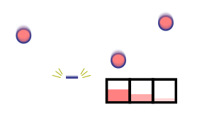

# Project Assignment: Storms of High-energy Particles <!-- omit in toc -->

- Course: Computação de Alto Desempenho (High-Performance Computing), DI, FCT NOVA, 2023/2024
- Date: Monday, 9th October 2023
- Deadline for the project submission: 7th November, 2023
- Classroom link: <https://classroom.github.com/a/ZZjBbV1W>
- Submission form: <https://docs.google.com/spreadsheets/d/1D-LBgeWHZICbJusohI_RF1JbGhfIyjuf/edit#gid=1300327889>

## Table of Contents <!-- omit in toc -->

- [Teaching Staff](#teaching-staff)
- [Assignment: Storms of High-energy Particles](#assignment-storms-of-high-energy-particles)
  - [Introduction](#introduction)
  - [Sequential code description](#sequential-code-description)
    - [Program Arguments](#program-arguments)
    - [Wave file format](#wave-file-format)
    - [Functional description](#functional-description)
    - [Debug mode](#debug-mode)
  - [Project Development and Submission](#project-development-and-submission)
    - [Working rules](#working-rules)
    - [Working methodology](#working-methodology)
      - [OpenGL solution](#opengl-solution)
    - [Grading Criteria](#grading-criteria)
      - [Group grading criteria (G)](#group-grading-criteria-g)
      - [Individual grading criteria (S)](#individual-grading-criteria-s)
      - [Individual lab grading (L)](#individual-lab-grading-l)
      - [Grade discussion](#grade-discussion)
    - [Project Report Format, Structure, and Important Dates](#project-report-format-structure-and-important-dates)
- [Version history](#version-history)


## Teaching Staff

- [João Lourenço](mailto:joao.lourenco@fct.unl.pt)
- [Alex Davidson](mailto:a.davidson@fct.unl.pt)

## Assignment: Storms of High-energy Particles

**Task: Write a CUDA *or* OpenGL program that implements a simulation of high-energy particle bombardment on an exposed surface.**

Please read this document carefully. This is the project assignment for the course of High-Performance Computing, edition 2023-24. This assignment is strongly based in the EduHPC’18 Peachy Assignment from the Trasgo Research Group of the Universidad de Valladolid.

The deadline for the project submission (code and report) is 7th November 2023.
The project submission is done by filling the [Google Sheet form](https://docs.google.com/spreadsheets/d/1D-LBgeWHZICbJusohI_RF1JbGhfIyjuf/edit#gid=1300327889) with the commit ID of your code and project
(the date/time of the commit ID must be before the deadline). More info on the
project submission will be provided later.

_Please remember that you are expected to develop your own project solution, and that any attempt to cheat implies immediate failure in the course!_

### Introduction

You are provided a sequential program that simulates the effects of high-energy particles bombardment on an exposed surface, for example in the surface of space vessels in outer space.

The problem and the provided code are conveniently simplified, considering only a
cross-section of the surface. The section is represented by a discrete number of control
points equally distributed on the outermost layer of the material. An array is used to
store the amount of energy accumulated on each point. The program computes the energy
accumulated on each point after the impact of several waves of high-energy particles (see
Figure 1). The program calculates and reports, for each wave, the point with the highest
accumulated energy, which presents the higher risk of being damaged.



_Figure 1: A collection of high-energy particles transfers energy to the impact point and to approaching its neighborhood. the target surface. The impacting particle transfers energy to the impact point and to its neighborhood._

The program output below (Figure 2) corresponds to  an array of 30 control points, after three waves
with several random particles on each one. For each control point the output shows its final
energy value, and a string of characters that graphically represents the value as a bar. The length
of the bar is normalized with the maximum energy after the last wave. If the last character of
the bar is an ”x”, it indicates that this point was identified as a local maximum after the last
wave. An ”M” character followed by a number at the end of the bar indicates that the value in
the point was identified as the highest energy after the wave indicated on the associated number.
This graphical representation is optionally shown when the program is compiled in debug mode.
It is followed by the execution time of the main computation, excluding the times for start-up,
reading data from files, and writing the output. The last line shows the list of positions and
maximum energy values after each wave.

```
0.3996 |ooooooooooooooooooooooooooooooooooooooo
0.4325 |ooooooooooooooooooooooooooooooooooooooooooo
0.4684 |oooooooooooooooooooooooooooooooooooooooooooooo
0.5092 |oooooooooooooooooooooooooooooooooooooooooooooooooo
0.5308 |ooooooooooooooooooooooooooooooooooooooooooooooooooooo
0.5398 |oooooooooooooooooooooooooooooooooooooooooooooooooooox
0.5371 |ooooooooooooooooooooooooooooooooooooooooooooooooooooo
0.5472 |oooooooooooooooooooooooooooooooooooooooooooooooooooooo
0.5646 |oooooooooooooooooooooooooooooooooooooooooooooooooooooooo
0.5914 |ooooooooooooooooooooooooooooooooooooooooooooooooooooooooooo
0.6009 |ooooooooooooooooooooooooooooooooooooooooooooooooooooooooooox M2
0.6004 |ooooooooooooooooooooooooooooooooooooooooooooooooooooooooooo
0.5878 |oooooooooooooooooooooooooooooooooooooooooooooooooooooooooo
0.5858 |oooooooooooooooooooooooooooooooooooooooooooooooooooooooooo
0.5829 |oooooooooooooooooooooooooooooooooooooooooooooooooooooooooo M0
0.5692 |oooooooooooooooooooooooooooooooooooooooooooooooooooooooo
0.5464 |oooooooooooooooooooooooooooooooooooooooooooooooooooooo
0.5219 |oooooooooooooooooooooooooooooooooooooooooooooooooooo
0.5078 |oooooooooooooooooooooooooooooooooooooooooooooooooo
0.5042 |oooooooooooooooooooooooooooooooooooooooooooooooooo
0.5079 |oooooooooooooooooooooooooooooooooooooooooooooooooo
0.5122 |ooooooooooooooooooooooooooooooooooooooooooooooooooo
0.5157 |ooooooooooooooooooooooooooooooooooooooooooooooooooo
0.5238 |oooooooooooooooooooooooooooooooooooooooooooooooooooo
0.5363 |ooooooooooooooooooooooooooooooooooooooooooooooooooooo
0.5488 |ooooooooooooooooooooooooooooooooooooooooooooooooooooox
0.5475 |oooooooooooooooooooooooooooooooooooooooooooooooooooooo M1
0.5297 |oooooooooooooooooooooooooooooooooooooooooooooooooooo
0.4957 |ooooooooooooooooooooooooooooooooooooooooooooooooo
0.4537 |ooooooooooooooooooooooooooooooooooooooooooooo

Time: 0.000042
Result: 14 0.381967 26 0.499453 10 0.
```

*Figure 2: Example of output of the program in debug mode for an array of 30 positions and three waves of particles.*

### Sequential code description

#### Program Arguments 

The program receives the following arguments:
| Argument | Description |
| -------- | -------- |
| `size`   | Number of control points, or array positions to store energy values. |
| `list of wave files` | A sequence of filenames with the information of each wave. The same file name can appear several times. |

#### Wave file format

Particle information is read from a text file and stored in an array. The base type of
this array is a structure with fields for the details of each particle on the wave. The first
line of a file contains the number of particles described in it. Each line afterwards contains
the data of one particle in the wave. There are two pieces of integer data for each particle, separated
by a white space: The index of the impact point, and the energy value in thousandths of a Joule.

Students are **strongly encouraged** to manually create or automatically generate their own *test files*. Some form of **testing** that can be demonstrated is critical to achieving a good grade. 

Several examples are provided along with the code. You are allowed (and encouraged) to share your own wave files and simulation results with your colleagues, preferably *publicly* in the Piazza forum.

#### Functional description

The program first reads the wave files and stores each one in an array of particles. Then, for each wave, it executes the same stages as listed below.

1. **The bombardment phase.** For each particle in the wave, the program transforms the energy to a float value in Joules and traverses the array positions, computing how much energy should be accumulated at each point. When a particle impacts, its energy is transmitted to the contact point and to those in the neighborhood. The exact energy accumulated at a point is calculated taking into account an attenuation, in terms of the distance to the impact point. The further away the impact point, the lower the energy accumulated. However, there is a minimum energy threshold (which usually depends on the material) that can be accumulated due to the impact. No energy is accumulated at the points where the minimum threshold is not reached, due to its distance to the impact point.
2. **The relaxation process.** In this phase the material reacts by slightly distributing its charge. Each control point is updated with the average value of three points: the previous one, the point itself, and the next one. To avoid destroying the original values in the array while they are still needed to update other neighbors, the array values are first copied to a second ancillary array before the relaxation. The old values are read from the ancillary array, while the new values are written to the original array.
3. **Maximum energy point location.** In this last stage that process each wave, the point with the maximum energy is located and its value and position are stored. After all the waves have been processed, the maxima and positions for all waves are printed.

#### Debug mode

If the source is compiled with the `-DDEBUG` flag, and the array size is not greater than 35 cells, a graphical representation of the results is presented, as discussed before. This output can be compared before and after program modifications. Consider executing a program several times with the same parameters to try to detect random changes in the output originated by race conditions.

### Project Development and Submission

#### Working rules

The following working rules apply. As this list is not exhaustive, in case of doubt do not hesitate in asking the teaching staff on Piazza.

- The project work will be done in grops of 3 students (unless explicitly authorized otherwise).
- Each group must use the [GitHub classroom link](https://classroom.github.com/a/ZZjBbV1W) to create a new repository for producing their project code and report. When you click the link you will be asked to create or join an existing group. You **MUST** name your group `gNN_AAAAA_BBBBB`, where `gNN` is your group number (e.g., “g07”), `AAAAA`, and `BBBBB`, are the student numbers (IDs) of the two group members. If this is done correctly, your new repository name must be `cad2023-2024-proj1_gNN_AAAAA_BBBBB`.
- Remember that your new repository must be private and shared only among the group members. 
- The group must respect and use the “Git Workflow”. Each member will have a local copy of the repository in his/her computer where individual work shall take place.

- Each student will commit his/her own individual work into the group shared repository.
- Commit messages must describe clearly what was changed/added in that commit (and why). Commit messages are very important. Take you time to write good commit messages!
- Remember to push your (local) commits to your groups remote main repository.
- Each project must include an [INSTRUCTIONS.md](./INSTRUCTIONS.md) file with instructions on how to compile and run the test programs.
- The project report must have the look and feel of a research article, using the templates (Word or LATEX) provided in the folder “Templates” in the original repository. If you use LATEX, please use the “bare_jrnl_compsoc.tex” with front size 10. If you use Word, leave the font size as is.
- The project report is limited to a maximum of 4 pages (see Section 3.4 for more info on the Project’s Report). You may (and should) use a search engine to learn on how to write a research article.

#### Working methodology

You are given a reference sequential version of the code (energy_storms.c), and another identical source file (energy_storms_cuda.cu or energy_storms_opengl.c) to develop the parallel CUDA or OpenGL version.

The following strategy is recommended:

1. Download the source code by using the following classroom link: <https://classroom.github.com/a/ZZjBbV1W>.
2. Study the original source code and be sure you understand it. Please feel free to discuss the source code with your colleagues (and the teachers) in Piazza or, if necessary, directly with the teachers.
3. Identify the best candidate statements/functions to exploit parallelism using your preferred programming toolset.
4. Identify and remove the code dependences that may hinder the parallelization correctness and/or performance impact.
5. Use the CUDA/OpenGL programming model to parallelize the program.
6. Run some preliminary tests to confirm the correctness of your parallelization approach.
7. Evaluate the impact of your parallelization.
8. Find potential performance bottlenecks (maybe using a profiler).
9. If any performance bottleneck is found, fix it and goto step 6.
10. If no performance bottleneck is found, look for additional (minor) blocks/functions that can be parallelized.
11. If some is found goto step 4.
12. Log into the [cluster](https://cluster.di.fct.unl.pt/) (credentials will be provided later) and run selected performance tests there (**remember that your CPU time in the cluster is limited**).
13. If your results in the cluster do not match your expectations, go back to your development machine and to step 4.
14. Write your report. See Section 3.4 for suggestions/recommendations/rules for the report.

##### OpenGL solution

*Remember that if you decide to use OpenGL, you will need to define a separate .cl file for your kernel code, see the Lab 02 code for an example.*

#### Grading Criteria

Some general advice: spending almost all of your project time programming and optimising your code, and only leaving the last hours to quickly write your report, will most certainly result in a project grade much below your expectations. So, leave at leastone week for benchmarking your solution, and for creating and writing your project report!

##### Group grading criteria (G)

The **group grade** (G) is the same to all the elements of the group and will strongly depend on our appreciation of the group’s work as perceivable from the written report. Other relevant criteria include: 

- easiness of compilation and execution;
- cleanness and readability of the source code;
- correctness of the results;
- execution time/performance;
- scalability.

##### Individual grading criteria (S)

The **individual grade** (S) is potentially different for each group member and will strongly depend on both: the work division as reported by the group; and on my own appreciation of the individual contribution of each group member to the joint group’s work, as perceivable from the written report. Other relevant criteria include: 

- compliance with the “Git Workflow”;
- size and number of commits;
- meaningfulness of commit messages.

##### Individual lab grading (L)

The **total individual lab grade** (L) will be calculated as a weighted averaged following the formula:

```
L = 0.7 × (G) + 0.3 × (S)
```

##### Grade discussion

Both the group members and the professor may ask for an individual or collective (group) presentation and discussion of the project. As a result of such a presentation and discussion, both the group grade (G) and the individual grade (S) may be revised up or downwards.

#### Project Report Format, Structure, and Important Dates

The report shall be written strictly following the format provided in the templates folder in the source repository and have the *"look & feel"* of a research paper. The report length is limited to four pages of text and graphics, plus one extra page for:

| Section | Description |
| ------- | ----------- |
| Bibliography | Remember to add all the documents and websites relevant to your work to the bibliography section. Moreover, remember that you must cite these works in the text wherever they were relevant. |
| Acknowledgments | Please identify (number and name) your colleagues that were somehow helpful to your group while developing the project. Also explain why/how they helped you; |
| Individual contribution(s) | Please present your group working methodology and list clearly: i) how the work was divided between the group members, and ii) the relative contribution of each member (in percentage). For example, A did whatever (30%), and B did a lot of stuff (70%). If the group members cannot agree in the terms/contents for this sectin, add one (identified) separate statement for each group member. |
| Comments, criticisms, and suggestions | All your comments, critics and suggestions are very welcome. My goal is to provide you with an interesting and educational project (and course) and all your feedback is very welcome. Of course this section will have **no impact** on your grade. |

## Version history


| Date | Version | Description |
| ---- | ------- | ----------- |
| 2023-10-09 | 1.0 | Initial version. |
